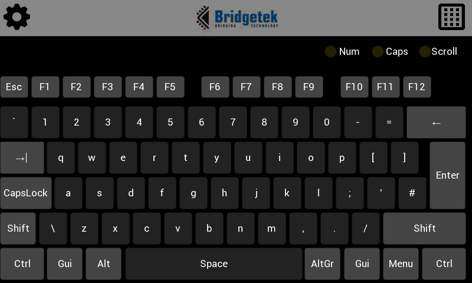

# Example Projects in C to Drive Eve with Pico
## Basic 
A minimal project to draw a simple screen on LCD

## pico_SimHub_Dashboard_Demo

A dashboard application running with SimHub

## pico_SimHub_Leaderboard_Demo

A leaderboard application running with SimHub

## pico_Spaced_Invaders_Demo 

This is a version of the classic arcade game. There is an option for connecting a pico module to physical buttons or a joystick on GPIOs.

## pico_Virtual_Keyboard_Demo 

This is a virtual keyboard touchscreen. This connects via USB and appears as a HID keyboard to the host.

