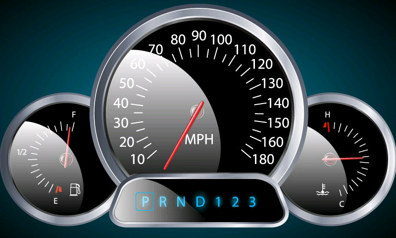

# pico SimHub Dashboard Demo

This is a simplified dashboard for use with SimHub. It will accept a custom message from SimHub.

The screen will show the data received from SimHub. Here is a sample of the display.



## Setup SimHub Messages

### Step 1: 
Open Arduino -> My Hardware

### Step 2: 
Select **Multiple Arduinos**. Find the pico COM port appears in the Hardware scan.

### Step 3: 
At new **MULTIPLE USB SETTINGS**:
 * Fill in Device Name “pico EVE Dash”. The baud rate is not used.
 * Edit the Custom protocol:
```
format([DataCorePlugin.GameData.NewData.SpeedMph]*10,'0') + ';' +
([DataCorePlugin.GameData.NewData.Rpms]) + ';' +
[DataCorePlugin.GameData.NewData.Gear] + ';E'
```
### Step 4: 
Then Click the button **Apply Changes Now**.

## Default Build
By default the project will build for the BT817 as used in the IDM2040-7A module. To change this alter the FT8XX_TYPE in the CMakeLists.txt file.

```
# Modify these to set the target GPU and display
set(FT8XX_TYPE BT817)
set(DISPLAY_RES WVGA)
```

## Screenshots

A screenshot can be taken by defining the ENABLE_SCREENSHOT macro. To take a screenshot, connect to the stdio serial port and send a fake SimHub command "!!" (two exclamation marks). 

The screenshot sends the data from the screen to the stdio port as a binary stream. The display will pause for up-to a minute to allow the data to be sent. It can be captured with a terminal emulator. The data is in the format PPM and is bookended by the string "PPM start\n" and "PPM end\n". This muse be stripped before use.

To convert the screenshot from the PPM format to JPG the following command can be used within Imagemagick to make the conversion:
```
magick.exe convert ppm:screenshot.ppm screenshot.jpg
```
