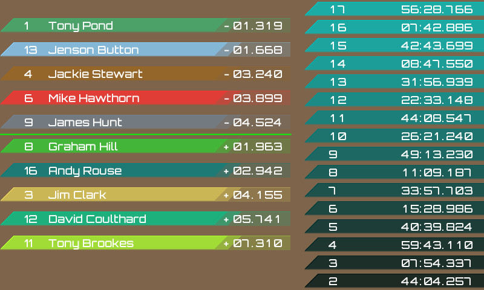

# pico SimHub Dashboard Demo

This is a simplified leaderboard for use with SimHub. It will accept a custom message from SimHub. 

The screen will show the data received from SimHub. Here is a sample of the display.



## Test Program

It is not always easy to setup the correct data from SimHub. There is a python script (for python 3) in
the "test" directory. This will connect to the console/stdio port on the pico and send valid test data
to the device.

By default the script will use *COM18* to transmit data. This *MUST* be changed to correspond to the
CDC ACM Virtual Com Port made by the program on the pico. 

## SimHub Messages

The format of the messages is:

### Identify driver:
```!PD;<car number>;<driver name>;<time>```
#### Examples:
```!PD;99;27;Jimmy McRae;0.000```

### Notify new lap time:
```!PL;<lap number>;<lap time>```
#### Examples:
```!PL;1;34:35.369```<br>
```!PL;2;32:31.467```

### Update rankings:
There can be up-to 5 drivers ahead or behind reported by SimHub.<br>
Start ranking update: ```!PS```<br>
Rank ahead: ```!PA;<places ahead>;<car number>;<driver name>;<time difference>```<br>
Rank behind: ```!PB;<places ahead>;<car number>;<driver name>;<time difference>```<br>
Commit ranking update: ```!PU```<br>
#### Examples:
```
	!PS
	!PA;4;2;Russell Brooks;-03.436
	!PA;3;3;Jim Clark;-03.464
	!PA;2;4;Jackie Stewart;-02.441
	!PA;1;5;Stirling Moss;-01.122
    !PA;0;15;Will Hoy;-01.001
    !PB;0;11;Tony Brookes;+00.009
	!PB;1;6;Mike Hawthorn;+00.101
	!PB;2;7;Nigel Mansell;+00.339
	!PB;3;8;Graham Hill;+01.044
	!PB;4;9;James Hunt;+01.504
	!PU
```
## Setup SimHub Messages

### Step 1: 
Open Arduino -> My Hardware

### Step 2: 
Select **Multiple Arduinos**. Find the pico COM port appears in the Hardware scan.

### Step 3: 
At new **MULTIPLE USB SETTINGS**:
 * Fill in Device Name “pico EVE Dash”. The baud rate is not used.
 * Edit the Custom protocol:
```
'L;' + format([DataCorePlugin.GameData.NewData.CompletedLaps],'0') + ';' +
([DataCorePlugin.GameData.NewData.LastLapTime]) + ';' +
'S\n' +
'A;4;' + [PersistantTrackerPlugin.DriverAhead_04_CarNumber] + ';' + [PersistantTrackerPlugin.DriverAhead_04_Name] + ';' + [PersistantTrackerPlugin.DriverAhead_04_Gap] + ';\n' +
'A;3;' + [PersistantTrackerPlugin.DriverAhead_03_CarNumber] + ';' + [PersistantTrackerPlugin.DriverAhead_03_Name] + ';' + [PersistantTrackerPlugin.DriverAhead_03_Gap] + ';\n' +
'A;2;' + [PersistantTrackerPlugin.DriverAhead_02_CarNumber] + ';' + [PersistantTrackerPlugin.DriverAhead_02_Name] + ';' + [PersistantTrackerPlugin.DriverAhead_02_Gap] + ';\n' +
'A;1;' + [PersistantTrackerPlugin.DriverAhead_01_CarNumber] + ';' + [PersistantTrackerPlugin.DriverAhead_01_Name] + ';' + [PersistantTrackerPlugin.DriverAhead_01_Gap] + ';\n' +
'A;0;' + [PersistantTrackerPlugin.DriverAhead_00_CarNumber] + ';' + [PersistantTrackerPlugin.DriverAhead_00_Name] + ';' + [PersistantTrackerPlugin.DriverAhead_00_Gap] + ';\n' +
'B;4;' + [PersistantTrackerPlugin.DriverBehind_04_CarNumber] + ';' + [PersistantTrackerPlugin.DriverBehind_04_Name] + ';' + [PersistantTrackerPlugin.DriverBehind_04_Gap] + ';\n' +
'B;3;' + [PersistantTrackerPlugin.DriverBehind_03_CarNumber] + ';' + [PersistantTrackerPlugin.DriverBehind_03_Name] + ';' + [PersistantTrackerPlugin.DriverBehind_03_Gap] + ';\n' +
'B;2;' + [PersistantTrackerPlugin.DriverBehind_02_CarNumber] + ';' + [PersistantTrackerPlugin.DriverBehind_02_Name] + ';' + [PersistantTrackerPlugin.DriverBehind_02_Gap] + ';\n' +
'B;1;' + [PersistantTrackerPlugin.DriverBehind_01_CarNumber] + ';' + [PersistantTrackerPlugin.DriverBehind_01_Name] + ';' + [PersistantTrackerPlugin.DriverBehind_01_Gap] + ';\n' +
'B;1;' + [PersistantTrackerPlugin.DriverBehind_00_CarNumber] + ';' + [PersistantTrackerPlugin.DriverBehind_00_Name] + ';' + [PersistantTrackerPlugin.DriverBehind_00_Gap] + ';\n' +
'U\n'
```
The current driver and car number can be set by adding 'D;<your car number>;<Your Name>' to the command

### Step 4: 
Then Click the button **Apply Changes Now**.

## Default Build
By default the project will build for the BT817 as used in the IDM2040-7A module. To change this alter the FT8XX_TYPE in the CMakeLists.txt file.

```
# Modify these to set the target GPU and display
set(FT8XX_TYPE BT817)
set(DISPLAY_RES WVGA)
```
