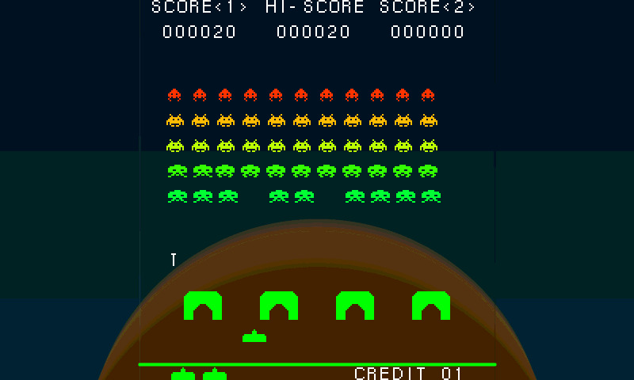

# pico Spaced Invaders Demo

This is a version of the classic arcade game. It is rendered on the EVE display using the pico MCU to control the action. There is an option for connecting a pico module to physical buttons or a joystick on GPIOs. The left, right and centre areas of the touchscreen can be used to control the action. The buttons or joystick option is not available on the ID2040-7A module as the GPIO lines are not available.



## Options

By default the project will build for the BT817 as used in the IDM2040-7A module. To change this alter the FT8XX_TYPE in the CMakeLists.txt file.

```
# Modify these to set the target GPU and display
set(FT8XX_TYPE BT817)
set(DISPLAY_RES WVGA)
```
## Arcade Buttons and Joysticks

Within the code the physical buttons can be enabled or disabled by altering the 'ARCADE_BUTTONS' macro. Define the macro it to allow buttons to be used on the GPIO lines. Undefine it to use the touchscreen only.

The pins on a pico module used for the buttons are as follows:
- Pin 34 - Fire/Start Button - pulled up (GPIO28)
- Pin 32 - Left Button - pulled up (GPIO27)
- Pin 31 - Right Button - pulled up (GPIO26)

## Screenshots

A screenshot can be taken by defining the ENABLE_SCREENSHOT macro. To enable 'action' screenshots it it implemented that every 100 times the fire button is pressed it will take a screenshot.

The screenshot sends the data from the screen to the stdio port as a binary stream. The game will pause for up-to a minute to allow the data to be sent. It can be captured with a terminal emulator. The data is in the format ARGB4 and is bookended by the string "ARGB start\n" and "ARGB end\n". This must be stripped before use.

To convert the screenshot from the ARGB4 format to JPG the following command can be used within Imagemagick to make the conversion:
```
magick.exe convert -size 800x480 -depth 4 -color-matrix "0 0 0 0 1, 1 0 0 0 0, 0 1 0 0 0, 0 0 0 0 0, 0 0 0 0 0" -background black rgba:screenshot.argb screenshot.jpg
```
