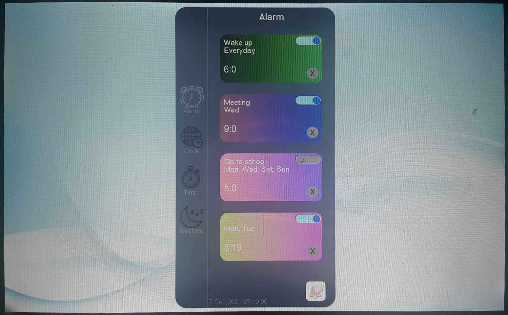

## INTRODUCTION
This is a demo for an alarm clock using BridgeTek EVE and RP2040
Tested with CircuitPython version 7.0.0
```

```

## HARDWARE 
- 1 ME817EV
- 1 MM2040EV
- 1 LCD 1280x800 or LCD 800x480

## STARTUP
- Start MM2040EV with adafruit-circuitpython-raspberry_pi_pico-en_US-7.0.0-alpha.3.uf2
- Copy source code in Python into CircuitPython drive:
    + lib (which include "bteve" folder )
    + code.py
    + folder alarm_clock
- Demo should start after that    
    
                                   【END】